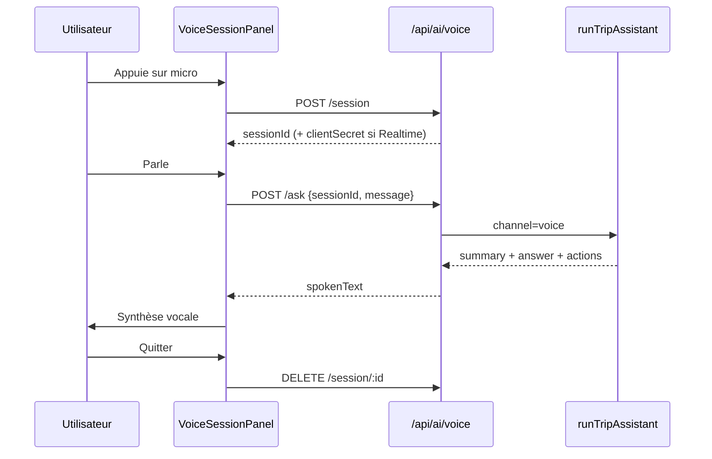

# Agent vocal Sebavio

## 1. Architecture

L’agent vocal réutilise le même cerveau métier que le chat texte : `runTripAssistant`.

```
Client (micro)
  → Provider (pipeline STT/TTS | OpenAI Realtime | mock)
  → POST /api/ai/voice/ask
  → runVoiceAsk → runTripAssistant(channel=voice)
  → spokenText + structured JSON
  → TTS / Realtime audio
```

Aucun second « cerveau » IA n’est créé. Le canal `voice` ajoute uniquement des instructions orales au prompt système.

## 2. Flux (diagramme)



## 3. Variables d’environnement

| Variable | Défaut | Rôle |
|----------|--------|------|
| `VOICE_AGENT_ENABLED` | false | Interrupteur global |
| `VOICE_AGENT_WEB_ENABLED` | true | Web |
| `VOICE_AGENT_MOBILE_ENABLED` | false | Apps mobiles |
| `VOICE_AGENT_ANDROID_AUTO_ENABLED` | false | Android Auto |
| `VOICE_AGENT_CARPLAY_ENABLED` | false | CarPlay |
| `VOICE_AGENT_PROVIDER` | pipeline | `openai_realtime` \| `pipeline` \| `mock` |
| `OPENAI_REALTIME_MODEL` | gpt-4o-realtime-preview | Modèle Realtime |
| `OPENAI_REALTIME_VOICE` | alloy | Voix Realtime |
| `VOICE_MAX_SESSION_SECONDS` | 600 | TTL session |
| `VOICE_MAX_MONTHLY_SECONDS` | 3600 | Quota mensuel |
| `VOICE_MAX_CONCURRENT_SESSIONS` | 1 | Sessions actives / user |
| `VOICE_SESSION_RATE_LIMIT_*` | 10 / 3600 | Anti-abus Redis |
| `VOICE_DEFAULT_LANGUAGE` | fr-CA | Langue STT/TTS |
| `OPENAI_API_KEY` | — | Serveur uniquement (tokens éphémères) |

`OPENAI_API_KEY` n’est **jamais** exposée au client. Seul un `client_secret` éphémère Realtime peut être renvoyé.

## 4. Administration

Page `/admin/ai` → section **Agent vocal** : flags (sans secrets), quotas, sessions 30 j, plateformes.

## 5. Entitlements

- Clé : `ai.voice.enabled`
- Capacité produit : `voice_agent`
- Découverte : false ; forfaits complets : true
- Les admins contournent l’entitlement

## 6. Cycle de vie session

1. `POST /api/ai/voice/session` — entitlement, rate-limit, quota, ownership voyage
2. Provider `connect` + écoute
3. Tours `ask` (persistance conversation via `runTripAssistant`)
4. `PATCH` heartbeat (métriques / seconds)
5. `DELETE` fin (`user_quit`, `expired`, erreur)

Table `ai_voice_sessions` + événements `ai_voice_usages`.

## 7. Metering

Événements : `session_start` | `heartbeat` | `session_end` | `error`.  
Quota mensuel = somme `seconds_delta` du mois UTC.

## 8. Erreurs (messages FR-CA)

| Code | Sens |
|------|------|
| `VOICE_DISABLED` | Feature off |
| `VOICE_PLATFORM` | Plateforme non autorisée |
| `ACCESS_DENIED` | Forfait sans vocal |
| `VOICE_RATE_LIMIT` | Trop de sessions |
| `VOICE_MONTHLY_LIMIT` | Quota mensuel |
| `VOICE_CONCURRENT` | Session déjà active |
| `VOICE_SESSION` | Session invalide / expirée |
| `VOICE_CONFIGURATION` | Config / Realtime |

## 9. Sécurité

- Auth.js `requireActiveUser` sur toutes les routes
- Ownership voyage via `getOwnedTripOrThrow`
- Session liée à `userId` + `tripId`
- Pseudonyme `sha256(userId + salt)` pour analytics
- Pas de GPS précis dans les tables vocales
- Secrets uniquement serveur

## 10. Déploiement

Sans Docker. Après migration Prisma :

```bash
npx prisma migrate deploy && npx prisma generate
# build + restart PM2 sebavio uniquement
```

Ports : 3050 (dev). Prod : https://sebavio.com

## 11. Désactivation d’urgence

```bash
VOICE_AGENT_ENABLED=false
# puis redémarrer le process PM2 sebavio
```

Le chat texte reste disponible.

## 12. Android (mobile natif)

Flag `VOICE_AGENT_MOBILE_ENABLED` (off par défaut).

Contrat client :

1. `POST /api/ai/voice/session` avec `clientPlatform: "mobile"`, `tripId`, `usageMode`.
2. Brancher un provider natif (AudioRecord + Realtime WebRTC ou STT/TTS Android) sur la même abstraction `VoiceConversationProvider`.
3. Transmettre les tours via `POST /api/ai/voice/ask` (même cerveau `runTripAssistant`).
4. Afficher les événements structurés (`VoiceAgentEvent`) pour cartes restos / confirmations.
5. `DELETE /api/ai/voice/session/:id` à la fermeture / `onDestroy`.

Ne pas réutiliser Web Speech du navigateur dans l’APK.

## 13. Android Auto

Flag `VOICE_AGENT_ANDROID_AUTO_ENABLED`.

- UI via **Cars App Library** (templates officiels), pas une WebView Sebavio.
- `usageMode: "driving"` obligatoire ; `clientPlatform: "android_auto"`.
- Affichage minimal : micro, statut d’écoute, résumé court, arrêt, confirmation oui/non, navigation si autorisée.
- Le serveur vocal et les outils métier restent indépendants de l’UI Auto.
- Hors scope v1 : application Auto complète.

## 14. Android Automotive OS (AAOS)

Même contrat API que Android Auto (`clientPlatform` pourra être étendu).  
Distraction optimization : réponses très courtes, confirmations verbales, aucun contenu dense.  
Pas d’UI AAOS dans cette phase.

## 15. iOS

Même endpoints REST ; Speech framework / AVAudioEngine côté app.  
Feature flag `VOICE_AGENT_MOBILE_ENABLED`.  
Implémenter le même `VoiceConversationProvider` en Swift.

## 16. CarPlay

Flag `VOICE_AGENT_CARPLAY_ENABLED`.

- Nécessite une **app iOS native** + entitlement / catégorie CarPlay Apple (pas le site Web seul).
- Utiliser les modèles CarPlay autorisés (contrôle vocal / carte selon iOS ciblé).
- La conversation peut apparaître comme vue ou superposition carte selon les APIs disponibles.
- Serveur vocal + outils Sebavio restent indépendants de CarPlay.
- `usageMode: "driving"`, confirmations verbales courtes.
- Hors scope v1 : projet Xcode / CarPlay.
